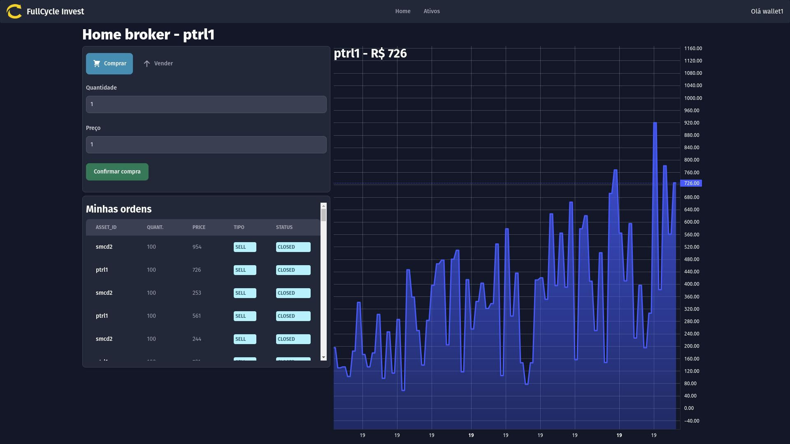

# Imersão Full Stack Full Cycle 13 - Full Cycle Invest

## Sobre o projeto
Projeto desenvolvido durante a décima terceira edição da Imersão Full Stack Ful Cycle, ocorrida em Junho de 2023.

O projeto consiste em um sistema que simula uma bolsa de valores, onde é possível comprar e vender os ativos.

O objetivo da imersão é aprender uma forma de comunicação assíncrona para aplicações de grande porte, utilizando-se do Apache Kafka como grande aliado para a transmissão de mensagens entre micro-serviços e SSE para transmitir eventos para o frontend em tempo real.

## Fluxo arquitetônico

## Ferramentas e tecnologias utilizadas
* Golang
* JavaScript
* TypeScript
* NestJS
* NextJS
* SSE (Server-Sent Events)
* Docker
* MongoDB
* Apache Kafka

## Animação da aplicação em funcionamento

## Capturas de tela

